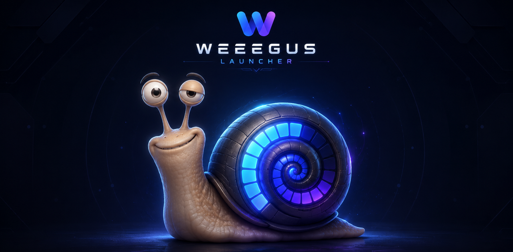
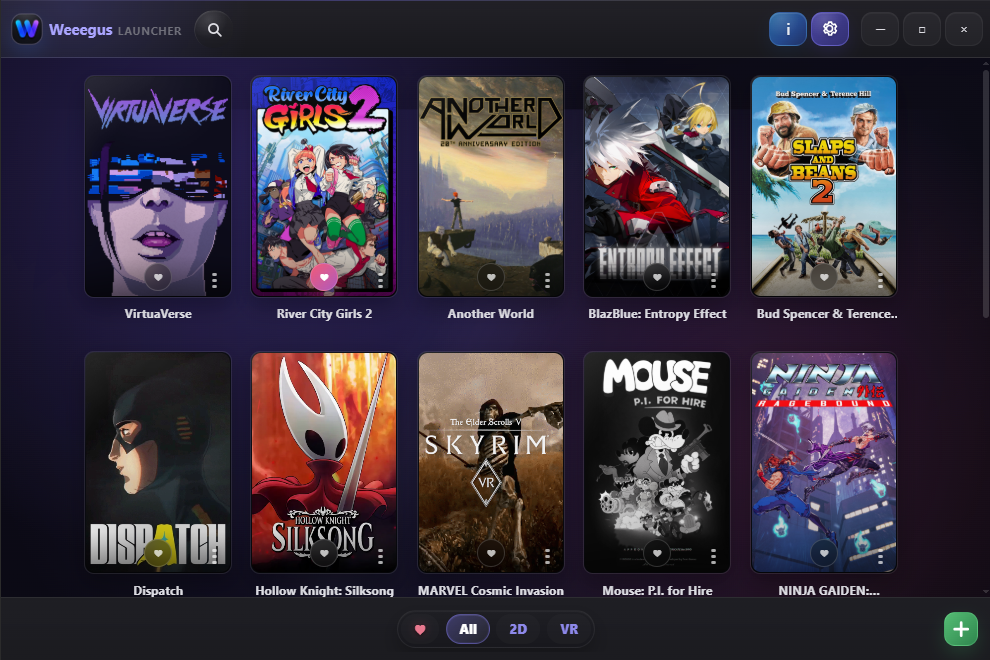
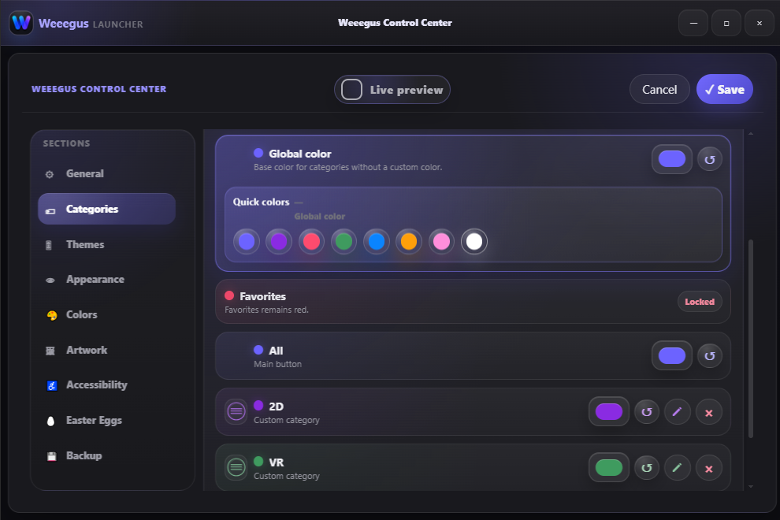
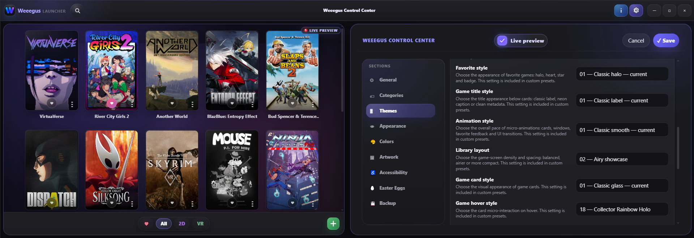

# **Weeegus Launcher**

### **Organize, customize, and launch your entire game library from one place.**

**Weeegus Launcher** is a portable Windows game launcher designed to bring all your games together in a clean, modern, and highly customizable library.

Add your games, organize them into categories, mark your favorites, customize their appearance, and launch them directly from an interface designed for both small collections and large game libraries.

---

## **✨ Main Features**

* **Customizable game library**
* Add, edit, and remove games
* Categories and favorites
* Fast game search
* Static and animated covers
* Artwork search through **SteamGridDB**
* Local artwork import
* Add or remove Steam shortcuts
* Multiple visual themes and interface styles
* Custom colors, effects, and animations
* Adjustable library zoom
* Backup, restore, and reset tools
* Built-in update system with file integrity verification
* Live settings preview
* Optional **Weeegus Survival** mode
* Portable data storage

## **🌍 Available in 14 Languages**

Weeegus Launcher currently supports:

* 🇬🇧 English
* 🇫🇷 French
* 🇪🇸 Spanish
* 🇩🇪 German
* 🇧🇷 Brazilian Portuguese
* 🇮🇹 Italian
* 🇵🇱 Polish
* 🇹🇷 Turkish
* 🇷🇺 Russian
* 🇺🇦 Ukrainian
* 🇨🇿 Czech
* 🇨🇳 Simplified Chinese
* 🇯🇵 Japanese
* 🇰🇷 Korean

The interface language can be detected automatically from Windows or selected manually in the settings.

---

## **🎨 Make It Your Own**

Weeegus includes a wide range of customization options:

* Game card styles
* Hover effects
* Accent colors
* Custom backgrounds
* Glow effects
* Interface animations
* Cover size
* Category display
* Animated cover playback

Changes can be previewed instantly through the built-in **live preview mode**.

---

## **📦 Portable and Easy to Use**

No complicated installation is required.

1. Extract the downloaded archive.
2. Launch **Weeegus Launcher**.
3. Start building your game library.

Your games are never moved, modified, or duplicated.

Weeegus only stores:

* Game launch paths
* Application settings
* Categories
* Favorites
* Custom artwork
* Interface preferences

All Weeegus data is stored locally, making the launcher easy to move, back up, and restore.

## Support the Project

If you enjoy Weeegus Launcher and want to support its development, you can help through the project’s support page.

Every contribution helps improve the launcher, polish the interface and keep the project moving forward.

